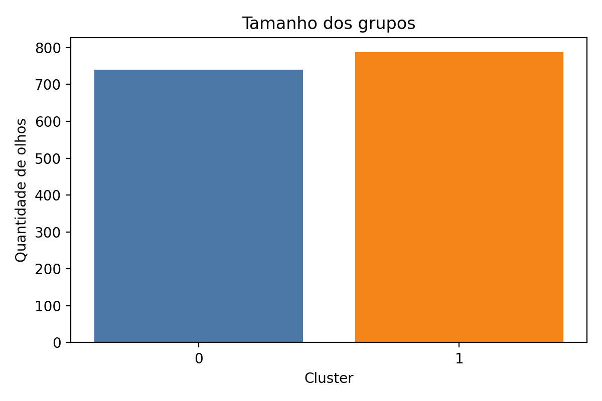
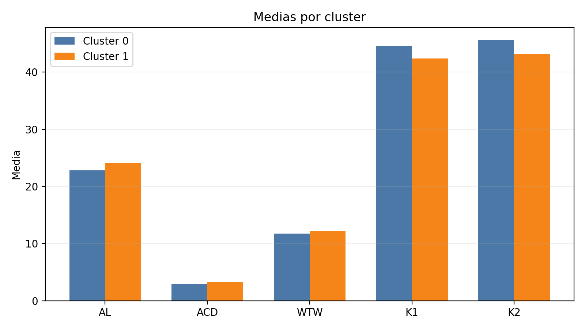
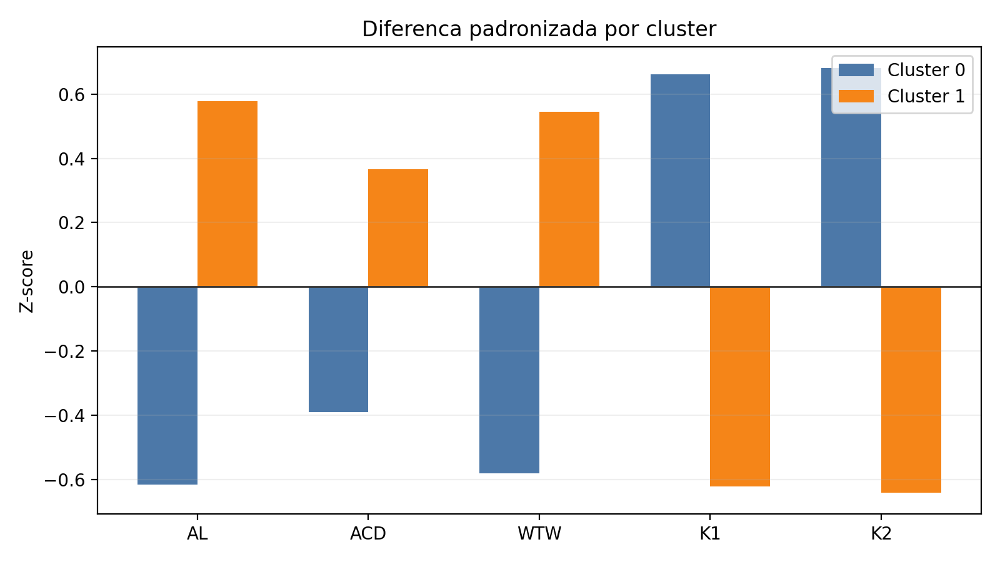

# Perfis de olhos (clustering)

---

## Capa

**Projeto:** Segmentacao de perfis de olhos por biometria

**Alunos:** Guilherme Coutinho, Herberty Freire, Leonardo Barbosa

**Matéria:** (Aprendizagem de Maquina)

**Data:** 2026-05-21

---

## Objetivo do trabalho

- Identificar perfis de olhos usando apenas variaveis biometricas: AL, ACD, WTW, K1, K2
- Descrever cada perfil de forma clara e acionavel para decisao clinica/operacional
- Entregar uma segmentacao interpretavel, sem usar classes pre-existentes

---

## Base analisada

- 1.528 registros
- Variaveis usadas:
  - AL: comprimento axial do olho
  - ACD: profundidade de camara anterior
  - WTW: distancia branco a branco
  - K1: curvatura no meridiano menos curvo
  - K2: curvatura no meridiano mais curvo
- Sem valores ausentes nas 5 variaveis

---

## Metodologia

- Padronizacao por z-score (todas as variaveis na mesma escala)
- Algoritmo: KMeans
- Teste de k entre 2 e 8
- Criterio de escolha: maior silhouette (separacao entre grupos)

---

## Resultado da selecao de k

- Melhor separacao em k = 2 (silhouette = 0,2866)
- Aumentar k reduziu a separacao entre grupos
- Decisao: adotar 2 perfis principais por maior estabilidade e interpretabilidade

---

## Tamanho dos grupos

- Cluster 0: 740 olhos
- Cluster 1: 788 olhos

---

## Grafico: tamanho dos grupos

---

## Perfis biometricos (medias)

| Cluster | AL | ACD | WTW | K1 | K2 |
|---|---:|---:|---:|---:|---:|
| 0 | 22,78 | 2,94 | 11,72 | 44,62 | 45,58 |
| 1 | 24,15 | 3,26 | 12,21 | 42,39 | 43,24 |

---

## Grafico: medias por cluster

---

## Perfil 1 (Cluster 0) - "Compacto e mais curvo"

- AL menor (olho mais curto)
- ACD menor (camara mais rasa)
- WTW menor (diametro corneano menor)
- K1 e K2 maiores (cornea mais curva)

**Mensagem executiva:** perfil compacto, com tendencia a maior curvatura corneana.

---

## Perfil 2 (Cluster 1) - "Longo e mais plano"

- AL maior (olho mais longo)
- ACD maior (camara mais profunda)
- WTW maior (diametro corneano maior)
- K1 e K2 menores (cornea mais plana)

**Mensagem executiva:** perfil alongado, com tendencia a menor curvatura corneana.

---

## Comparacao padronizada (z-score)

| Cluster | AL | ACD | WTW | K1 | K2 |
|---|---:|---:|---:|---:|---:|
| 0 | -0,62 | -0,39 | -0,58 | +0,66 | +0,68 |
| 1 | +0,58 | +0,37 | +0,55 | -0,62 | -0,64 |

---

## Grafico: diferenca padronizada

---

## Complemento (coluna "Correto")

> Apenas para descricao, nao usada no clustering.

- Cluster 0: S = 69,3% | N = 30,7%
- Cluster 1: S = 72,2% | N = 27,8%

**Observacao:** frequencias semelhantes, sem influencia na formacao dos grupos.

---

## Implicacoes para o cliente

- Dois perfis claros e interpretaveis para segmentacao
- Permite padronizar comunicacao clinica e operacional
- Suporta futuras analises: escolha de lentes, protocolos, e comunicacao de risco

---

## Recomendacoes

- Validar clinicamente os perfis com amostra de especialistas
- Explorar variacao intra-cluster para casos extremos
- Caso necessario, testar k=3 ou k=4 para granularidade adicional

---

## Referencias anatomicas

- https://www.draandreia.com.br/?page_id=1027
- https://www.draandreia.com.br/wp-content/uploads/2017/09/biom4.png

---

## Encerramento

- Segmentacao entregue com 2 perfis robustos
- Entregaveis: slides com graficos e resumo executivo de 1 pagina

